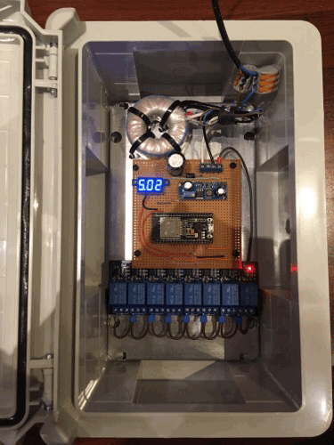

# Irrigation Controller
Simple, minimalistic Arduino sketch for eight irrigation valves

Features
--------
 * Arduino-ESP32
 * MQTT client uses TLS and checks the Root-CA
 * Can use many WiFi SSIDs
 * Watchdog switches valves off after a long time if no other command was send
 * Only one valve active at a time, this prevents pressure loss
 * Accepts OTA updates via HTTP+username+password
 
Hardware
--------
  1. toroid transformer (230VAC to 2x12VAC, 15VA)
  2. rectifier diode 1N5401 (=100V, 1A to 3A) or similar
  3. capacitor 1000µF, 63V
  4. DC/DC converter XL7015
  5. several distance bolts and screws (non-metallic, nylon, 3mm)
  6. Generic eight channel relais board
  7. perf board, striped
  8. ESP32 module with 36 pins!
  9. Enclosure ABS, 300x200x130, IP65, with mounting plate
  
  Design notes
  ----------------
  Irrigation valves are designed for 24VAC (alternating current, not DC). This is the most common voltage across different brands. Due to this a transformer is required. This transformer is connected to the mains for probably years and must withstand possible transient voltages (voltage spikes) that might occur. Long lasting and cheap are DIN-rail mounted doorbell transformers, but those either do not specify the idle current or it is not really good. A toroid transformer has fewer losses, but the hardware is more expensive. Regardless of the transformer, the output must provide a safe isolation between input and output. Look for appropriate safety marks, otherwise the output might sooner or later become a hazardous voltage.

It would be possible to simply use a SONOFF 4CH, but that would introduce another transformer (internal to the device) with a little extra idle current.

So, I decided to run everthing off the toroid transformer which is required anyway. An idling transformer will have a higher voltage than what it is rated for. Due to this the rectifier diode, input capacitor and DCDC converter must be able to cope with 24VAC + the extra voltage. Assuming an idling transformer has a 1.7 higher voltage than rated and the peak voltage is sqrt(2) larger than the AC voltage, the parts must be able to handle up to 60V-peak. One rectifier diode is sufficient if a rather larger capacitor is used, which is the reason for 1000µF at the input to the DCDC-converter. The DCDC-converter is based on XL7015 which is cheap and can handle up to 80V at the input. The modules from China have a little, adjustable potentiometer to adjust the output. It seems as if 5V is the lowest output voltage, which is ideal for the common USB powered ESP32 modules.

ESP32 modules offer several pins (=38 in this case), but many are already assigned to other peripherals or interfere with the boot process. Consult a pinout diagram for you module or at least check that GPIOs in the range 13 to 33 are used. In my case even one of the three GND pins was not working as intended and required to be left floating, otherwise the module got stuck in the bootloader when powered up.

The enclosure was selected because it is weather and bug proof (=IP65) and easy to drill. Cable glands must be fitted to the bottom, one for power and one for the cable towards the valves. The removable mounting plate was a huge pleasure: Just layout the desired components, drill holes and mount the hardware. Everthing is firmly attached this way. For the input I later added a fused terminal block to protect the transformer and to not have the input leads floating around inside the enclosure.

The ESP32 was selected, because the ESP8266 has less CPU and especially RAM. Also, in the future when WPA3 might be more widely adopted, ESP32 is more likely to receive an update whilst ESP8266 future is a bit uncertain in this regard. An irrigation controller will hopefully last for 10 years or more, so this might play a role in those years to come. Pricewise it does not really matter anymore anyway.

For cabling to the valves cables for direct burial are recommended. A cheap and good solution are cables for direct burialy telephone lines (~1 € per meter for A-2Y(L)2Y 4x2x0,8mm). This cable allows to control up to seven valves, because one conductor is required for ground and must be joined in the irrigation-valve-box. For the connections inside the irrigation-valve-box consider scotchlock for the joints as they are filled with grease and give a good, long lasting electrical connection in such potentially moist and dirty locations.
